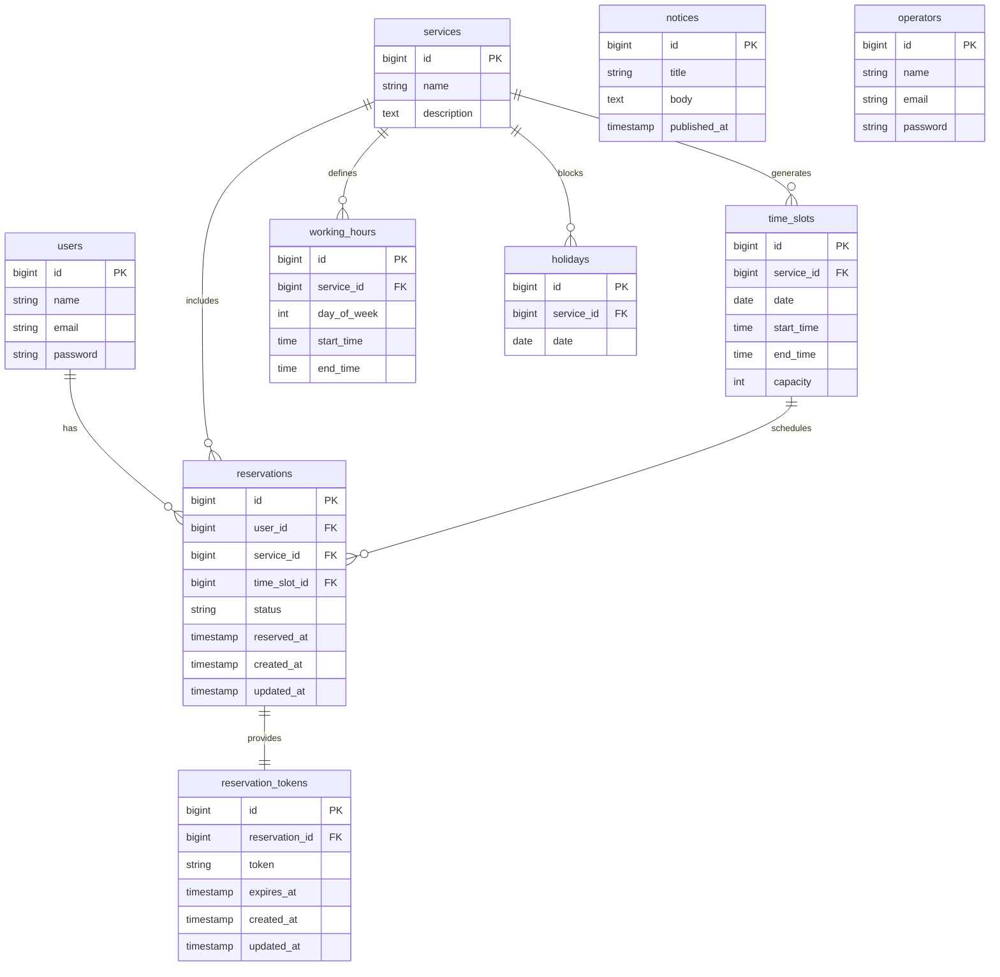

## 【users】
一般ユーザー情報

| カラム名           | 型         | 制約                              | 説明                        |
|--------------------|------------|-----------------------------------|-----------------------------|
| id                 | bigint     | PK, Auto Increment, NOT NULL      | ユーザーID（PK）            |
| name               | string     | NOT NULL                          | ユーザー名                  |
| email              | string     | UNIQUE, NOT NULL                  | メールアドレス              |
| password           | string     | NOT NULL                          | パスワード（ハッシュ化）    |
| email_verified_at  | timestamp  | NULL可                            | メール確認日時              |
| remember_token     | string     | NULL可                            | ログイントークン            |
| created_at         | timestamp  | NOT NULL                          | 作成日時                    |
| updated_at         | timestamp  | NOT NULL                          | 更新日時                    |

## 【operators】
管理者情報

| カラム名           | 型         | 制約                              | 説明                        |
|--------------------|------------|-----------------------------------|-----------------------------|
| id                 | bigint     | PK, Auto Increment, NOT NULL      | 管理者ID（PK）              |
| name               | string     | NOT NULL                          | 管理者名                    |
| email              | string     | UNIQUE, NOT NULL                  | メールアドレス              |
| password           | string     | NOT NULL                          | パスワード（ハッシュ化）    |
| email_verified_at  | timestamp  | NULL可                            | メール確認日時              |
| remember_token     | string     | NULL可                            | ログイントークン            |
| created_at         | timestamp  | NOT NULL                          | 作成日時                    |
| updated_at         | timestamp  | NOT NULL                          | 更新日時                    |

## 【services】
サービス情報

| カラム名           | 型         | 制約                              | 説明                        |
|--------------------|------------|-----------------------------------|-----------------------------|
| id                 | bigint     | PK, Auto Increment, NOT NULL      | サービスID（PK）            |
| name               | string     | NOT NULL                          | サービス名                  |
| description        | text       | NOT NULL                          | サービス説明                |
| created_at         | timestamp  | NOT NULL                          | 作成日時                    |
| updated_at         | timestamp  | NOT NULL                          | 更新日時                    |

## 【working_hours】
サービス提供時間帯（曜日ごと）

| カラム名           | 型         | 制約                              | 説明                        |
|--------------------|------------|-----------------------------------|-----------------------------|
| id                 | bigint     | PK, Auto Increment, NOT NULL      | 提供時間ID（PK）            |
| service_id         | bigint     | FK(services.id), NOT NULL         | サービスID（FK）            |
| day_of_week        | integer    | NOT NULL                          | 曜日（0:日曜〜6:土曜）      |
| start_time         | time       | NOT NULL                          | 開始時刻                    |
| end_time           | time       | NOT NULL                          | 終了時刻                    |
| created_at         | timestamp  | NOT NULL                          | 作成日時                    |
| updated_at         | timestamp  | NOT NULL                          | 更新日時                    |

## 【holidays】
サービス休業日情報

| カラム名           | 型         | 制約                              | 説明                        |
|--------------------|------------|-----------------------------------|-----------------------------|
| id                 | bigint     | PK, Auto Increment, NOT NULL      | 休業日ID（PK）              |
| service_id         | bigint     | FK(services.id), NOT NULL         | サービスID（FK）            |
| date               | date       | NOT NULL                          | 休業日                      |
| created_at         | timestamp  | NOT NULL                          | 作成日時                    |
| updated_at         | timestamp  | NOT NULL                          | 更新日時                    |

## 【time_slots】
予約枠情報

| カラム名           | 型         | 制約                              | 説明                        |
|--------------------|------------|-----------------------------------|-----------------------------|
| id                 | bigint     | PK, Auto Increment, NOT NULL      | 予約枠ID（PK）              |
| service_id         | bigint     | FK(services.id), NOT NULL         | サービスID（FK）            |
| date               | date       | NOT NULL                          | 日付                        |
| start_time         | time       | NOT NULL                          | 開始時刻                    |
| end_time           | time       | NOT NULL                          | 終了時刻                    |
| capacity           | integer    | NOT NULL                          | 定員                        |
| created_at         | timestamp  | NOT NULL                          | 作成日時                    |
| updated_at         | timestamp  | NOT NULL                          | 更新日時                    |

## 【reservations】
予約情報

| カラム名           | 型         | 制約                              | 説明                        |
|--------------------|------------|-----------------------------------|-----------------------------|
| id                 | bigint     | PK, Auto Increment, NOT NULL      | 予約ID（PK）                |
| user_id            | bigint     | FK(users.id), NOT NULL            | ユーザーID（FK）            |
| service_id         | bigint     | FK(services.id), NOT NULL         | サービスID（FK）            |
| time_slot_id       | bigint     | FK(time_slots.id), NOT NULL       | 予約枠ID（FK）              |
| status             | string     | NOT NULL                          | 予約ステータス              |
| reserved_at        | timestamp  | NOT NULL                          | 予約日時                    |
| created_at         | timestamp  | NOT NULL                          | 作成日時                    |
| updated_at         | timestamp  | NOT NULL                          | 更新日時                    |

## 【reservation_tokens】
予約確認トークン情報

| カラム名           | 型         | 制約                              | 説明                        |
|--------------------|------------|-----------------------------------|-----------------------------|
| id                 | bigint     | PK, Auto Increment, NOT NULL      | トークンID（PK）            |
| reservation_id     | bigint     | FK(reservations.id), NOT NULL     | 予約ID（FK）                |
| token              | string     | UNIQUE, NOT NULL                  | トークン文字列              |
| expires_at         | timestamp  | NOT NULL                          | 有効期限                    |
| created_at         | timestamp  | NOT NULL                          | 作成日時                    |
| updated_at         | timestamp  | NOT NULL                          | 更新日時                    |

## 【notices】
お知らせ情報

| カラム名           | 型         | 制約                              | 説明                        |
|--------------------|------------|-----------------------------------|-----------------------------|
| id                 | bigint     | PK, Auto Increment, NOT NULL      | お知らせID（PK）            |
| title              | string     | NOT NULL                          | タイトル                    |
| body               | text       | NOT NULL                          | 本文                        |
| published_at       | timestamp  | NULL可                            | 公開日時                    |
| created_at         | timestamp  | NOT NULL                          | 作成日時                    |
| updated_at         | timestamp  | NOT NULL                          | 更新日時                    |

## 【ER図】

---

### 💡 ER図補足メモ（設計意図）

- `users`：一般利用者。会員登録して予約を行う。
- `operators`：管理者（現在は1名想定）。将来的に予約への関与も検討。
- `services`：予約対象となるサービス。所要時間などを含む。
- `working_hours`：曜日ごとの営業時間帯ルール。サービス単位で管理。
- `holidays`：特定日単位での臨時休業や定休日管理。サービス単位で紐づく。
- `time_slots`：実際の予約可能枠（date + start/end time）。通常は `working_hours` に基づいて生成、手動追加も想定。
- `reservations`：ユーザーが確定させた予約。サービス・枠・ステータスなどを保持。
- `reservation_tokens`：メール経由の予約キャンセルに使う一時トークン。
- `notices`：利用者向けお知らせ。CMS的な役割。
--- フッター開始 ---

[← READMEに戻る](../README.md)

## 📚 ドキュメント一覧

- [プロジェクト概要](project-overview.md)
- [機能一覧](features.md)
- [画面・機能対応表](function_screen_map.md)
- [画面定義](screens.md)
- [ユースケース定義](usecase_reserve.md)
- [機能要件](functional_requirements.md)
- [コーディングルール](coding-rules.md)
- [APIレスポンス設計ガイドライン](api_response.md)
- [ショートカット](shortcuts.md)
- [バリデーション設計仕様](validation_spec.md)
- [UIガイドライン](ui_guideline.md)
- [UI改善ガイド](ui_improvement_guide.md)
- [アクセシビリティガイド](accessibility_guide.md) 
- [Zustand 状態管理ガイド](zustand_guide.md)
- [Laravel + Supervisor 設定ガイド](supervisor.md)
- [Laravel & Vite 環境構築・テスト・デプロイまとめ](laravel-vite-setup.md)
- [画面遷移図（PDF）](画面遷移図.pdf)
- [ワイヤーフレーム（PDF）](ワイヤーフレーム.pdf)

### 作業ログ
- [2025-07-07](logs/2025-07-07.md)
- [2025-07-08](logs/2025-07-08.md)
- [2025-07-09](logs/2025-07-09.md)
- [2025-07-10](logs/2025-07-10.md)
- [2025-07-11](logs/2025-07-11.md)
- [2025-07-15](logs/2025-07-15.md)
- [2025-07-17](logs/2025-07-17.md)
- [2025-07-18](logs/2025-07-18.md)
- [2025-07-22](logs/2025-07-22.md)
- [2025-07-23](logs/2025-07-23.md)
- [2025-07-24](logs/2025-07-24.md)
- [2025-07-25](logs/2025-07-25.md)
- [2025-07-28](logs/2025-07-28.md)
- [2025-07-29](logs/2025-07-29.md)
- [2025-07-30](logs/2025-07-30.md)
- [2025-07-31](logs/2025-07-31.md)
- [2025-08-01](logs/2025-08-01.md)
- [2025-07期まとめ](logs/2025-07.md)
- [2025-08-08](logs/2025-08-08.md)

### 色々やること
- [今後のTODOメモ](todo.md)

--- フッター終了 ---
